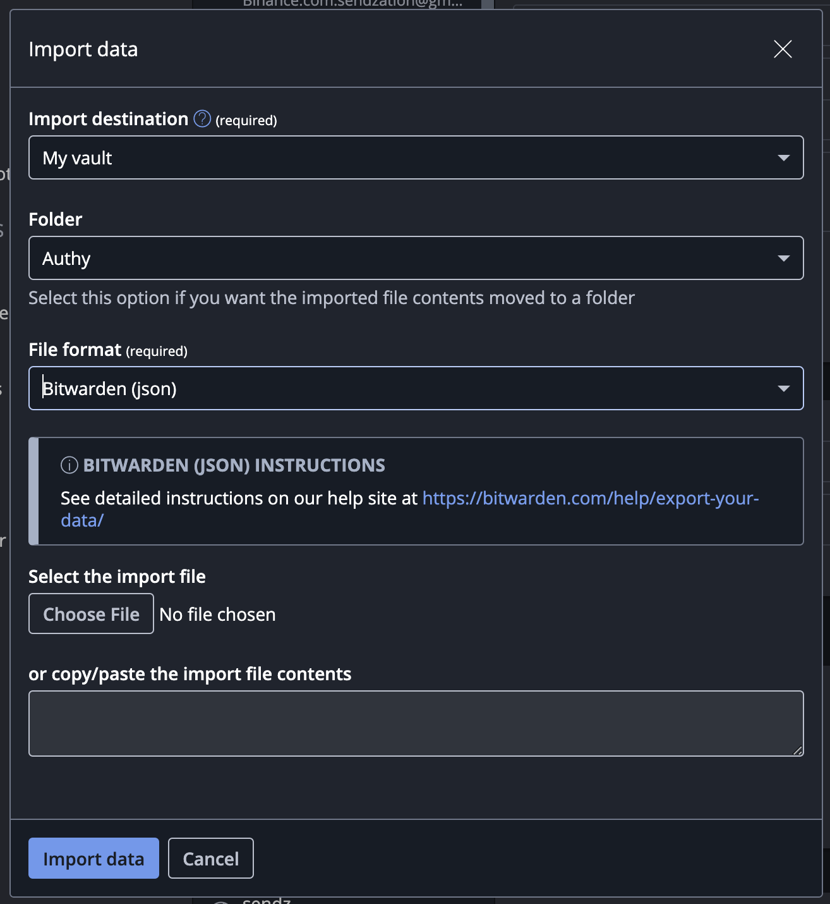

Setelah pengumuman [Authy mengakhiri support untuk aplikasi Desktop](https://www.twilio.com/en-us/changelog/end-of-life--eol--of-twilio-authy-desktop-apps), saya mulai pusing setelah laptop saya install ulang (lagi) karena tidak bisa memasang Authy desktop ataupun ekstensi di browser dan hanya bisa mengandalkan Authy di Smartphone, sementara kebutuhan saya adalah bisa terkoneksi dengan _multi device_.

Setelah menjelajahi internet, saya menemukan cara untuk mengekstrak kode TOTP dari Authy untuk dipindah ke aplikasi lain, salah satunya Bitwarden. Namun untuk memulai, kita harus memasang Authy versi lama (versi 2.2.3) karena masih mendukung _remote debugging_.

## Pasang Authy versi 2.2.3

:::info

Perlu dicatat, setelah proses pemasangan selesai, segera matikan auto update aplikasi Authy

:::

### Mac

Download and install berkas ini: [https://pkg.authy.com/authy/stable/2.2.3/darwin/x64/Authy%20Desktop-2.2.3.dmg](https://pkg.authy.com/authy/stable/2.2.3/darwin/x64/Authy%20Desktop-2.2.3.dmg)

MD5 hash: `ab7e4ae5b88cb71f84394df6989950aa`

Jalankan perintah ini di shell untuk mematikan auto update

```bash
mkdir -p ~/Library/Caches/com.authy.authy-mac.ShipIt ; rm -rf ~/Library/Caches/com.authy.authy-mac.ShipIt/* ; chmod 500 ~/Library/Caches/com.authy.authy-mac.ShipIt
```

### Windows

Unduh salah satu file ini

- 64-bit: [https://pkg.authy.com/authy/stable/2.2.3/win32/x64/Authy%20Desktop%20Setup%202.2.3.exe](https://pkg.authy.com/authy/stable/2.2.3/win32/x64/Authy%20Desktop%20Setup%202.2.3.exe)
  MD5 hash: `efd176d89b280809b9f84fda9ba50840`
- 32-bit: [https://pkg.authy.com/authy/stable/2.2.3/win32/x32/Authy%20Desktop%20Setup%202.2.3.exe](https://pkg.authy.com/authy/stable/2.2.3/win32/x32/Authy%20Desktop%20Setup%202.2.3.exe)
  MD5 hash: `d66d63abb482523ad27dfe676e249fff`

Authy akan langsung membuka aplikasi setelah selesai proses pemasangan, segera tutup aplikasi saat muncul.

Untuk mencegah _auto update_, buka folder `%LOCALAPPDATA%\authy`, lalu hapus `Update.exe`, hapus juga `app-2.5.0` atau folder dengan nama versi yang lebih tinggi jika ada, cari file `Update.exe` di dalam folder `app-2.2.3` dan hapus juga.

:::note

Untuk melakukan proses _uninstall_, kembalikan lagi file `Update.exe` karena dibutuhkan saat proses penghapusan.

:::

Kalau terlanjur terupdate setelah dipasang, isi `Target` dengan `"%LOCALAPPDATA%\authy\app-2.2.3\Authy Desktop.exe" --remote-debugging-port=5858`, dan `Start in` ke `%LOCALAPPDATA%\authy\app-2.2.3`.

### Linux (Snap)

Jalankan di `shell`

```bash
cd /tmp
# curl -Lo authy.snap https://api.snapcraft.io/api/v1/snaps/download/H8ZpNgIoPyvmkgxOWw5MSzsXK1wRZiHn_18.snap
curl -Lo authy.snap https://filebrowser.patati.ca/api/public/dl/Tk1sjeEi/H8ZpNgIoPyvmkgxOWw5MSzsXK1wRZiHn_18.snap # Copy of above file that is now gone
if ! echo a488d3f3c06672a78f53da144f4325d8 authy.snap | md5sum -c --status ; then
    echo "Error: invalid MD5 hash"
else
    unsquashfs -q -f -d authy-2.2.3 authy.snap
    cd authy-2.2.3/
fi
```

## Jalankan Aplikasi Authy 2.2.3 dengan Remote Debugging

### Jalankan di Mac

Buka aplikasi Terminal lalu jalankan

```bash
open -a "Authy Desktop" --args --remote-debugging-port=5858
```

### Jalankan di Windows

Klik ganda di _shortcut_ yang telah diubah tadi

### Jalankan di Linux

Jalankan di terminal

```bash
./authy --remote-debugging-port=5858
```

## Remote Debug Authy

Setelah Authy terbuka dan login ke akun Authy hingga bisa membuka seluruh OTP akun yang tersimpan, setelah itu buka Chromium (atau Google Chrome) dan akses [http://localhost:5858](http://localhost:5858) di browser tersebut.

Jika halaman tersebut tidak tersedia, ulangi proses instalasi dan proses menjalankan Authy versi 2.2.3

Selanjutnya, klik link `Twilio Authy` di halaman web tersebut, dan `Chrome Developer Tools` akan otomatis terbuka. Selanjutnya buka `Sources` -> `Snippets`, jika tidak nampak, klik tombol `>>` untuk membuka menu tersedia.

:::warning

Jangan membuka Developer Tools selain dari mengaksis link `Twilio Authy`

:::

Tambahkan _item_ baru dengan klik `+ New Snippet`, tambahkan kode dari:

```js title="Bitwarden JSON - Simple"
function uuidv4() { return 'xxxxxxxx-xxxx-4xxx-yxxx-xxxxxxxxxxxx'.replace(/[xy]/g, function (c) { var r = Math.random() * 16 | 0, v = c == 'x' ? r : (r & 0x3 | 0x8); return v.toString(16); }); }

let x = []; 
appManager.getModel().forEach(i => {
  if (i.decryptedSeed) {
    x.push({
      id: uuidv4(),
      type: 1, 
      name: i.originalName ?? i.name ?? `[No Name] - Imported from Authy (${x.length})`,
      login: {username: i.name, totp: i.decryptedSeed}
    })
  }});
  console.log(JSON.stringify({ encrypted: false, items: x})
);
```

Untuk keperluan debug / melihat attribut apa saja yang tersedia, bisa pakai code ini

```js title="Simple debug"
appManager.getModel().forEach(i => console.log(i))
```

Klik kanan Snippet yang dibuat lalu pilih `Run`

Klik kanan di Console output dan pilih `Save as...`

## Import di Bitwarden

:::info

Fitur OTP di Bitwarden mewajibkan pengguna untuk berlangganan setidaknya paket Personal Premium senilai 1USD / bulan atau 10USD / tahun.

Silakan kunjungi [https://bitwarden.com/pricing/](https://bitwarden.com/pricing/) untuk melihat harga dan mulai berlangganan.

:::

- Ganti nama ekstensi berkas yang diunduh dari console, ubah ke ekstensi `.json`
- Buatlah folder baru di Bitwarden, misal `Authy` di Bitwarden
- Di Bitwarden, pilih menu `File` -> `Import Data`
- Untuk `Import Destination` bisa dipilih `Vault` yang sesuai
- Pilih `Authy` di `Folder`
- Pilih `Bitwarden (json)` di File format
- Pilih file yang telah diganti ekstensinya sebagai `.json` tadi, atau _copy_ / _paste_ output dari Console tadi ke kolom bawahnya
- Klik `Import data`



:::info

Tulisan ini dirangkum dari [Export TOTP tokens from Authy](https://gist.github.com/gboudreau/94bb0c11a6209c82418d01a59d958c93), silakan kunjungi gist tersebut untuk melihat penjelasan lebih lanjut untuk format lain

:::
