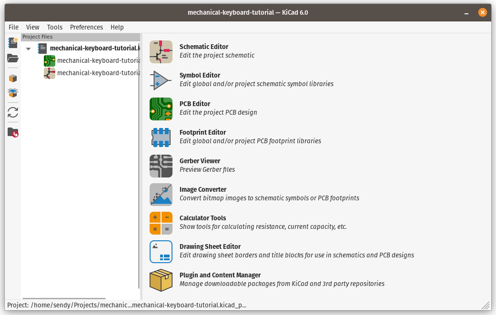
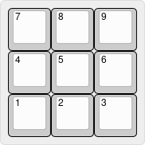

# Create New Project

Click `File` -> `New Project...` or simply press <kbd>Ctrl</kbd> + <kbd>N</kbd> to create a new project, fill in the name and it will create a new folder with two kicad files. In this case, I will use `mechanical-keyboard-tutorial` as the project name.

On this window, we will focus on `Schematic Editor` and `PCB Editor`, and we are going to create 9 keys (3x3) macropad / numpad.

