# Create PCB

To open the **PCB Editor**, just press <kbd>Ctrl</kbd> + <kbd>p</kbd> or double-click the `.kicad_pcb` file, in this case `mechanical-keyboard-tutorial.kicad_pcb`.

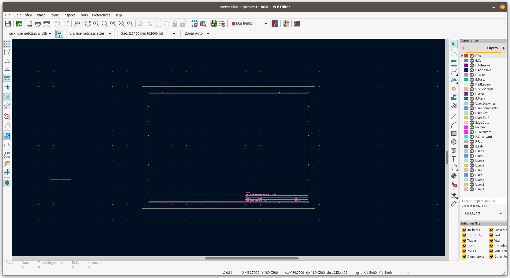

:::tip

**Keyboard Shortcuts**

- <kbd>Spacebar</kbd> - Reset Local Coordinates
- <kbd>Ctrl</kbd>+<kbd>Z</kbd> - Undo
- <kbd>Ctrl</kbd>+<kbd>Y</kbd> - Redo
- <kbd>K</kbd> - Track Display Mode
- <kbd>Delete</kbd> - Delete
- <kbd>Backspace</kbd> - Delete Track Segment
- <kbd>X</kbd> - Add New Track
- <kbd>V</kbd> - Add Via
- <kbd>Ctrl</kbd>+<kbd>V</kbd> - Add Microvia
- <kbd>/</kbd> - Switch Track Posture
- <kbd>D</kbd> - Drag Track, Keep Slope
- <kbd>P</kbd> - Place Item
- <kbd>C</kbd> - Copy Item
- <kbd>End</kbd> - End Track
- <kbd>M</kbd> - Move Item
- <kbd>F</kbd> - Flip Item
- <kbd>R</kbd> - Rotate Item
- <kbd>G</kbd> - Drag Item
- <kbd>T</kbd> - Get and Move Footprint
- <kbd>L</kbd> - Lock/Unlock Footprint
- <kbd>Ctrl</kbd>+<kbd>S</kbd> - Save Board
- <kbd>Ctrl</kbd>+<kbd>L</kbd> - Load Board
- <kbd>Ctrl</kbd>+<kbd>F</kbd> - Find Item
- <kbd>End</kbd> - Edit Item
- <kbd>PgDn</kbd> - Switch to Cooper Layer
- <kbd>F5</kbd> - Switch to Inner Layer 1
- <kbd>F6</kbd> - Switch to Inner Layer 2
- <kbd>PgUp</kbd> - Switch to Component Layer
- <kbd>+</kbd> - Switch to Next Layer
- <kbd>-</kbd> Switch to Previous Layer
- <kbd>O</kbd> - Add Module
- <kbd>W</kbd> - Switch Track Width to Next
- <kbd>Ctrl</kbd>+<kbd>W</kbd> - Switch Track Width to Previous
- <kbd>H</kbd> - Switch Highcontrast Mode

:::

## Grid Configuration

The most common grid size in mechanical keyboard is `19.05` x `19.05`, and we will use that number and divide by `4` or `8` to make us easier when moving and snapping all the footprints in the drawing sheet.

Why not exactly `19.05`? We need the smaller factor possible to place tiny components and routing, the larger the number will make it difficult to move the components or the routing.

Find the **Grid** options, and scroll down to choose **Edit User Grid...**

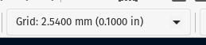

Fill with `19.05/4` or `19.05/8` in the **User Defined Grid** section, and it will automatically calculate the number when cursor move from the field. Then press <kbd>OK</kbd>

> I use `19.05/8` on this example

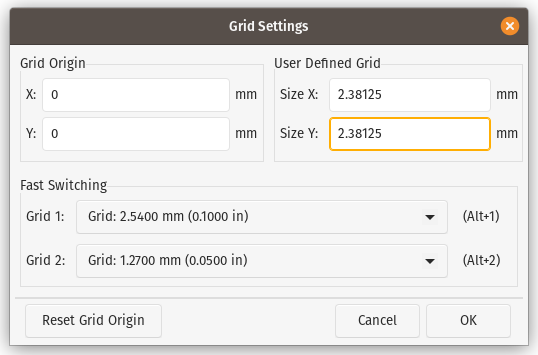

Next, back to the **Grid** option, and scroll down to select the previously defined **User Grid**

## Updating PCB from Schematic

To add all the footprints, we need to update the PCB Editor from what changed in Schematic Editor, on the keyboard, press <kbd>F8</kbd> or click this button on toolbar.


Click <kbd>Update PCB</kbd> button on the new prompt with default configuration.

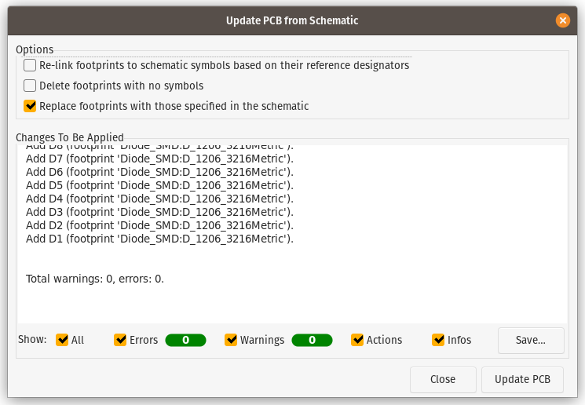

On the **PCB Editor**, just place all the imported footprints to the drawing sheet.

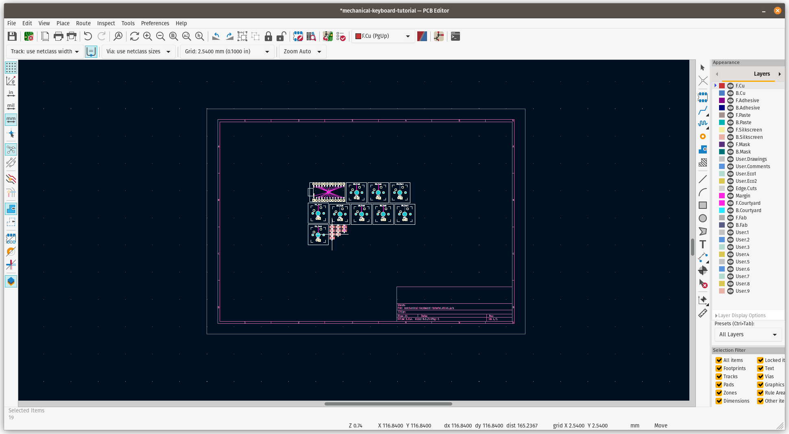

## Arrange the footprint

Back to the previous design preview, we will have 3x3 pad, and the ProMicro will sit on the left side. Just arrange the footprint on the drawing side.

```text title="Layout"
|------|---|---|---|
|      | 7 | 8 | 9 |
|      |---|---|---|
| Pro  | 4 | 5 | 6 |
| Micro|---|---|---|
|      | 1 | 2 | 3 |
|------|---|---|---|
```

```text title="Schematic Grid"
|------|---|---|---|
|      |SW1|SW2|SW3|
|      |---|---|---|
| MCU1 |SW4|SW5|SW6|
|      |---|---|---|
|      |SW7|SW8|SW9|
|------|---|---|---|
```

:::tip

The final design / product is up to you, this is for demo purpose only

:::

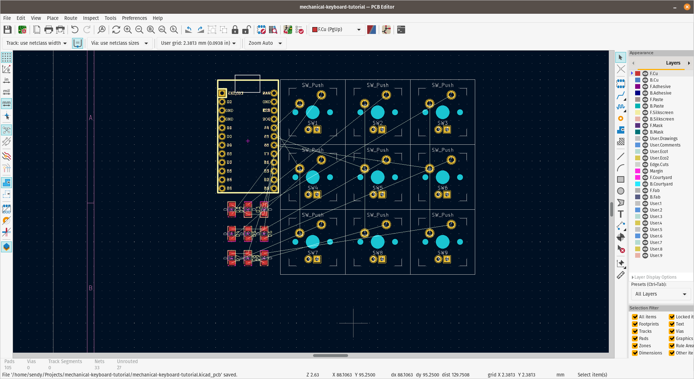

## PCB Cut

All footprints are in place, time to define the PCB edges so we can cut the PCB following the line. Select **Edge.Cuts** layer from the right sidebar in **Layers** tab, then **Draw a Line** or press <kbd>Ctrl</kbd>+<kbd>Shift</kbd>+<kbd>L</kbd>, next step is to pull the line and draw the PCB cut.

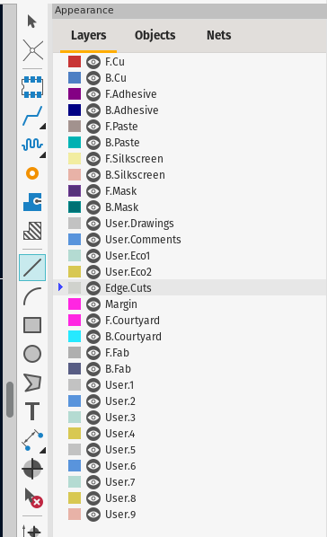

if you want rounded edge, play it and combine with **Draw an arc** tool, make sure all edges are snap each other.

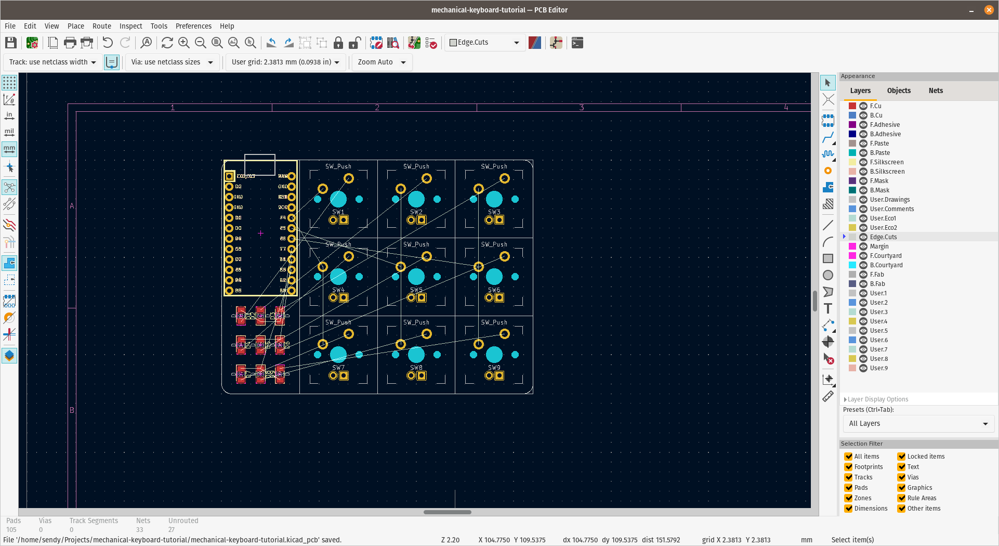

## Ground Plane

Next is to put ground plane to reduce electrical noise in PCB circuits. To add a ground plane, set **F.Cu** or **B.Cu** as active layer and press **Add a filled zone** or <kbd>Ctrl</kbd>+<kbd>Shift</kbd>+<kbd>Z</kbd>, and click where the ground plane start covering in drawing sheet, select **F.Cu** and **B.Cu** in **Layer** selection and **GND** in **Net** selection.

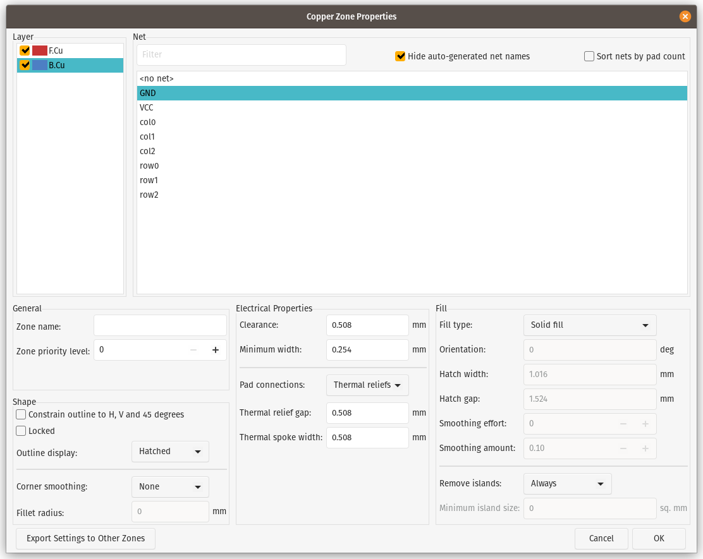

Draw the area covering whole PCB.

To cover whole PCB with **GND** fills, press <kbd>B</kbd>, to remove it press <kbd>Ctrl</kbd>+<kbd>B</kbd>.

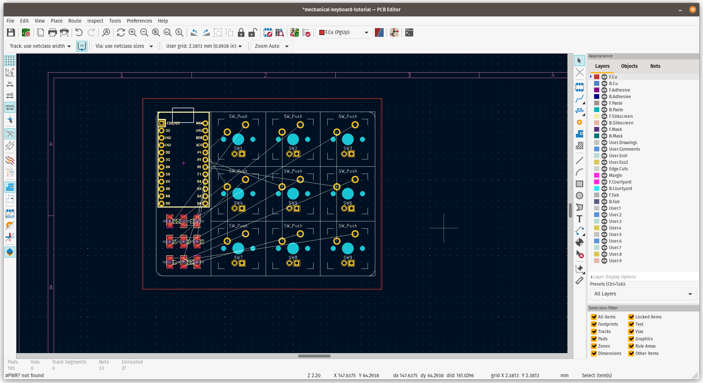

## Routing

You see we have virtual line with **white** color, we call it **Ratsnest**, this indicate the pad aren't connected correctly to their counterparts, we need to connect those with a routing line.

Activate **Route tracks** tool by press this icon or press <kbd>X</kbd>

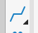

Follow the **Ratsnest** to connect all the pads.

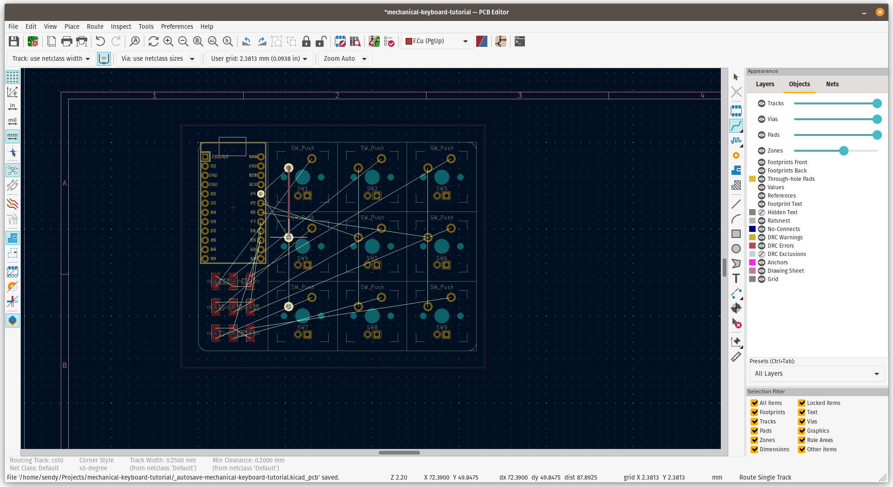

If you have difficulties to route because of layer conflicts, just use **via hole**

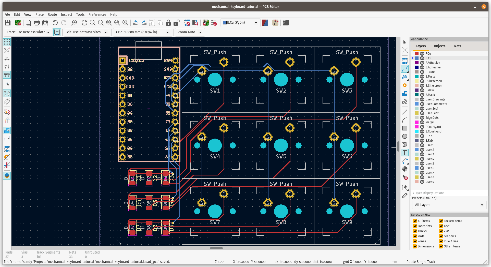

After all routes are connected, refill again the PCB by pressing <kbd>B</kbd>.

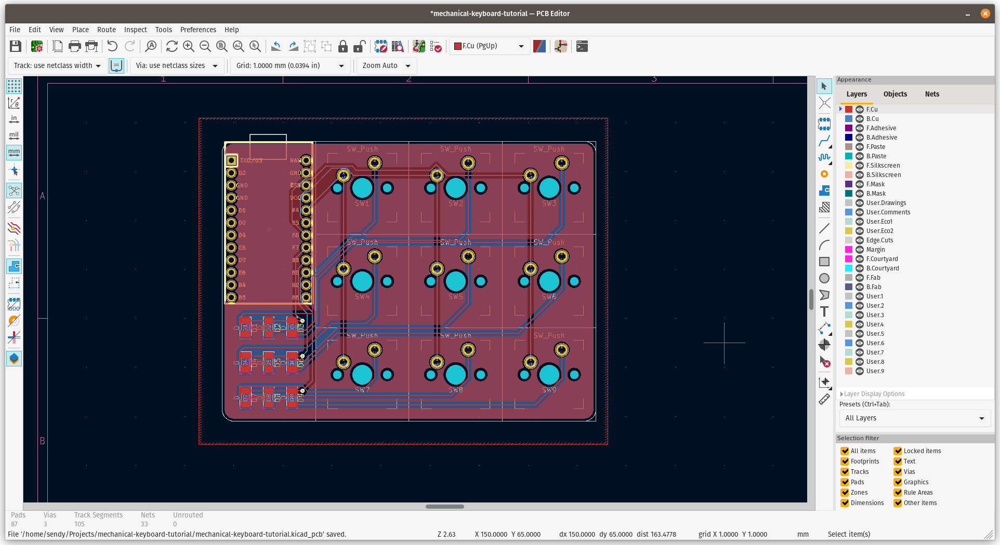

## 3D Viewer

KiCad have built in 3D preview, press <kbd>Alt</kbd>+<kbd>3</kbd> to open the PCB preview. On this window, you can inspect and preview all components or footprints in PCB, it also have 3D models for supported footprint.

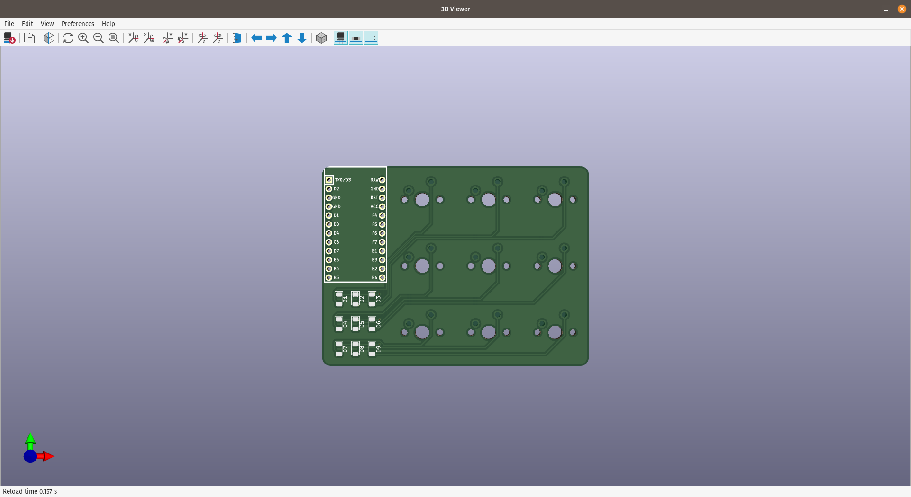

:::info

Congratulations! Now you have a macropad PCB!

:::
