# Create a Schematic

Schematic is a symbol diagram of electronic circuits. We need this to define layouts, routing, and component symbols.

## MCU Schematic

Before we jump in, there are two main alternatives for MCU, ATMEGA32U4 or Raspberry Pi RP2040. While we will working with either **Raspberry Pi Pico** development board or **Waveshare Zero** development board, **Arduino Pro Micro** also have similar steps.

:::info

To begin with **ATMEGA32U4**, you can continue to <a href="https://wiki.ai03.com/books/pcb-design/page/pcb-guide-part-3---creating-the-mcu-schematic" target="_blank">ai03 - PCB Guide</a> and for **RP2040**, continue to [Hardware Design with RP2040 Guide](https://datasheets.raspberrypi.com/rp2040/hardware-design-with-rp2040.pdf)

:::

First thing first, double click `mechanical-keyboard-tutorial.kicad_sch` in KiCad main window to open Schematic Editor, or press <kbd>Ctrl</kbd> + <kbd>E</kbd> in keyboard shortcut.

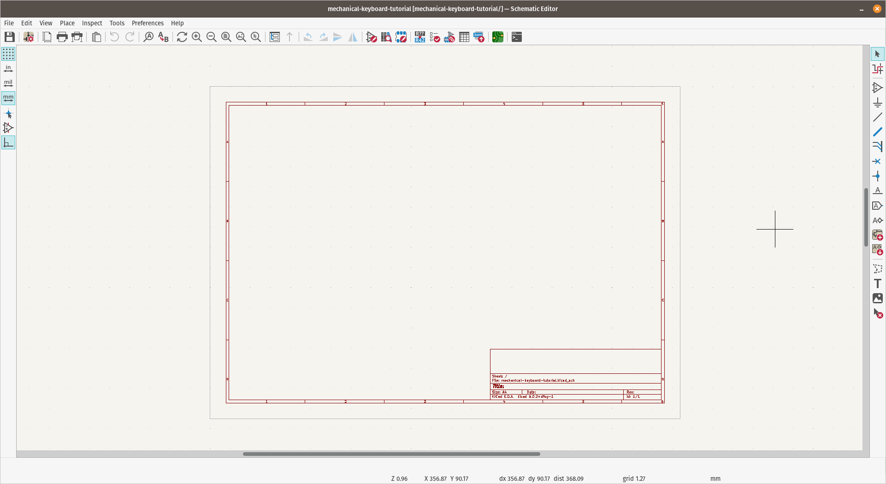

:::tip

Schematic editor keyboard shortcuts:

- <kbd>a</kbd> - To add component.
- <kbd>w</kbd> - To wire components.
- <kbd>v</kbd> - Edit component value.
- <kbd>s</kbd> - Change cursor to select mode.
- <kbd>Esc</kbd> - Escape mode or whatever command in progress and return to normal pointer mode.
- <kbd>Ctrl</kbd> + <kbd>z</kbd> - Undo. Use liberally to undo any mistakes.
- <kbd>Ctrl</kbd> + <kbd>s</kbd> - To save. Make sure to save often!

:::

## Placing Component

### ProMicro

To add a component, press <kbd>a</kbd> and find `ProMicro`, this will put `ProMicro` schematic symbol to the sheet.

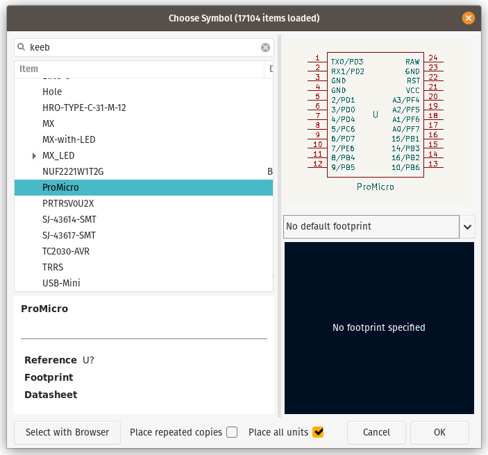

Next is to change the reference of ProMicro, to do so, click any label ended with `?` and press <kbd>e</kbd> to change the value and change it to `MCU1`, or just replace the `?` with `1` or any number. All reference field in schematic should end with number, like `D1`, `SW3`, etc.

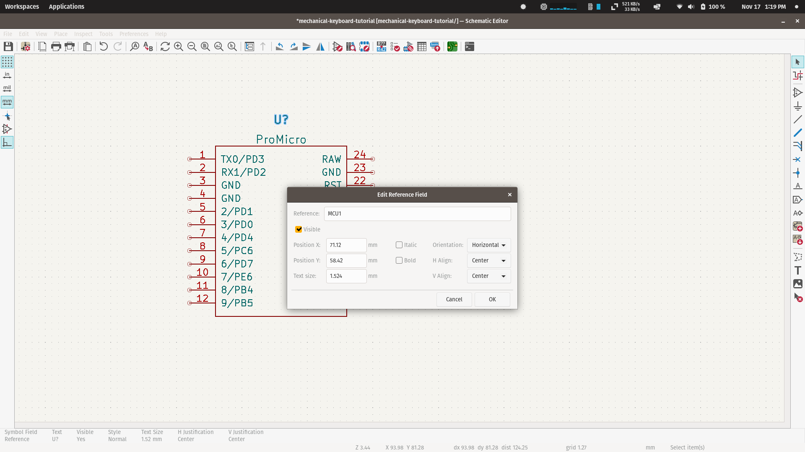

### Switches and Diodes

Press <kbd>a</kbd> again, find `sw_push` and add to the sheet, this will add **push switch** symbol that we will duplicate it later along with diode.

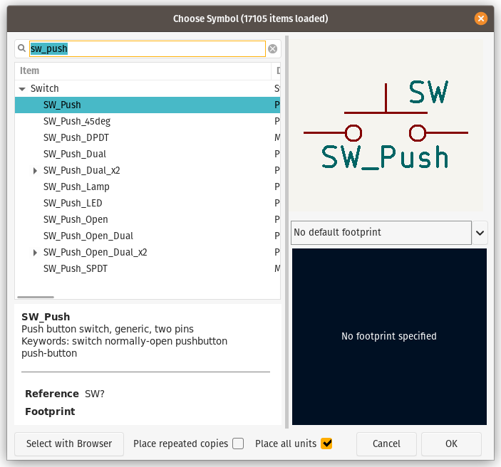

To add the diode, click anywhere on the worksheet while **component placement cursor** still active, and find `d` for **Diode** and place it at end of `SW_PUSH` end-node. Press <kbd>r</kbd> to rotate the symbol if needed.

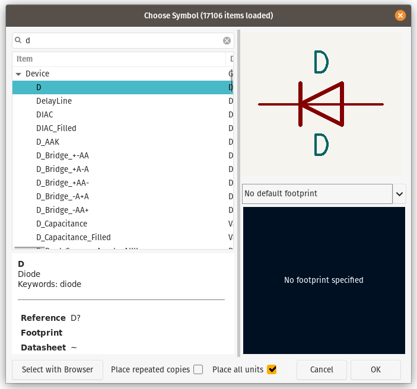

Now we will have Switch and Diode pair

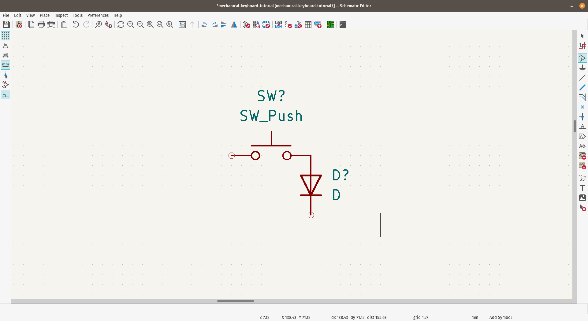

#### Duplication

First, reset cursor by press <kbd>s</kbd> or <kbd>Esc</kbd> twice and select Switch and Diode which already in place. Press <kbd>Ctrl</kbd> + <kbd>d</kbd> to duplicate the items and place it with 3x3 grid / matrix.

Now we have MCU and 9 pairs of switches and diodes

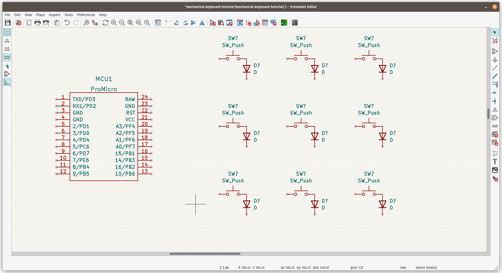

## Routing / Wiring

Hover your cursor over the start-node of the switches and draw a line to bottom and connect each of switches to create matrix `column`.

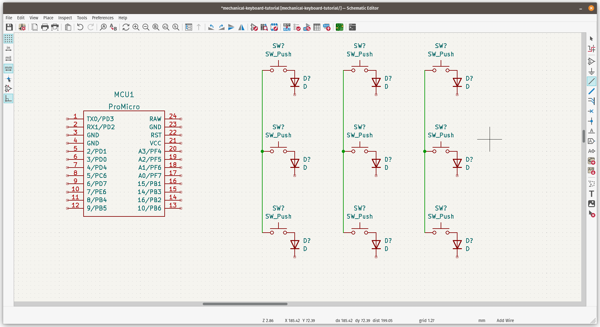

To create matrix `row`, just do the same but connect each end-node of diodes.

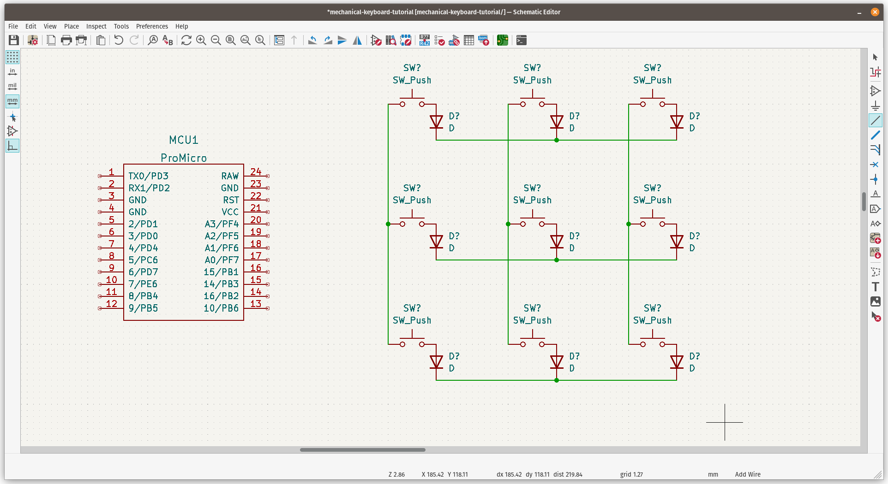

Don't bother with the switches and diodes labeling, KiCad can do it automatically later, and we have complete keyswitches matrix on schematic.

## Connect MCU to Matrix

Next step is to connect the routing between ProMicro and keys matrix, we have options to use `label` or use wire tool to connect them, but we will go with `label` so we can debug or identify the rows and columns easier.

To use **Label**, press <kbd>Ctrl</kbd> + <kbd>l</kbd> to activate **Global Label** cursor. We will label it with following manner:

- `col0` for first column
- `col1` for second column
- `col2` for third column
- `row0` for first row
- `row1` for second row
- `row2` for third row

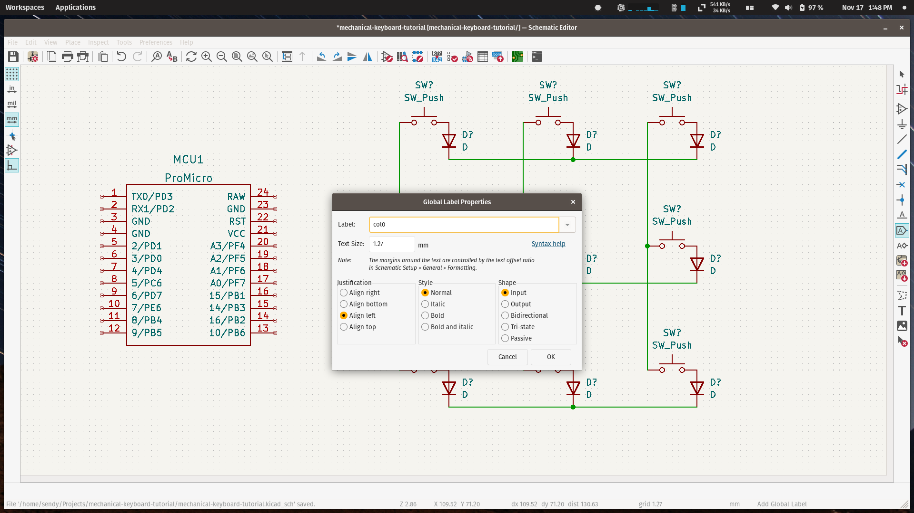

Next is to connect between MCU and matrix

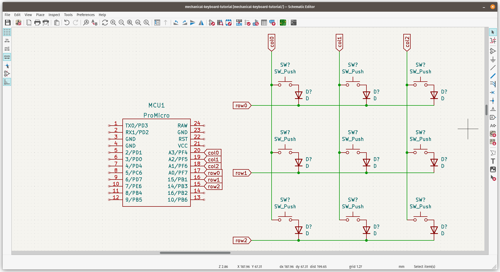

## Assign Component

All we have done is for symbols only, they don't have any component or footprint assigned to each symbol.

On the toolbar above, click `Run footprint assignment tools` with this icon

If you have any component that not annotated, a window will appear to verify how you want to annotate those components, just set the config that convenient for you and press <kbd>Annotate</kbd>.

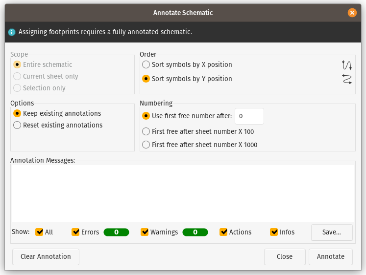

### Diodes

For diodes, I will use `Diodes_SMD` library, and `D_1206_3216` for all `D` symbol.

Block all the `D` symbol and double click on `D_1206_3216` on the right tab.

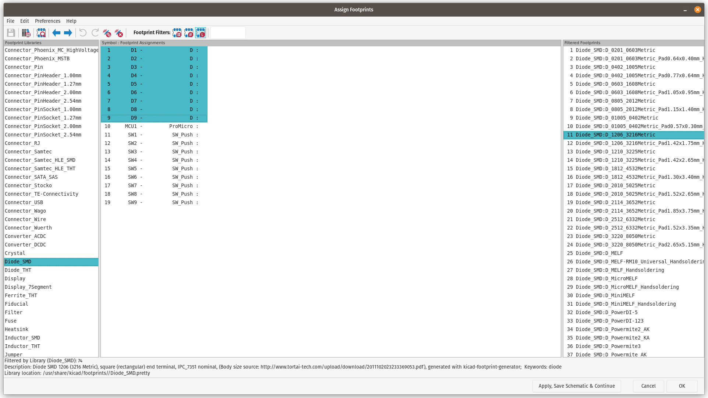