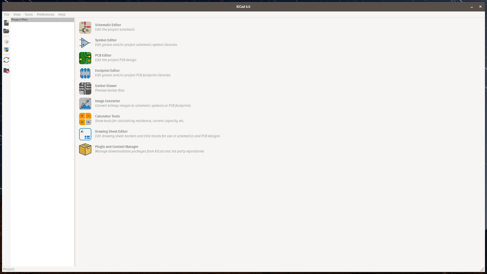

# Intro to KiCad EDA

KiCad is a cross platform and OpenSource Electronics Design Automation suite, we can create schematic, design a PCB layout and preview it with 3D viewer.

## Getting KiCad

You can download KiCad on their official web page here [Download | KiCad EDA](https://www.kicad.org/download/), if you are using Linux, you can install it via `flatpak` or find it on your distro's Software Center.

:::info

On this tutorial, I will focus on KiCad 6, I also recommend you to use KiCad 6 whilst waiting for KiCad 7 to become more stable.

:::
