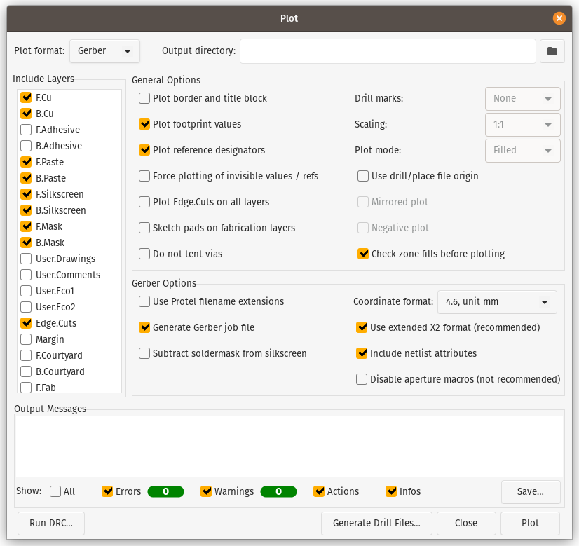
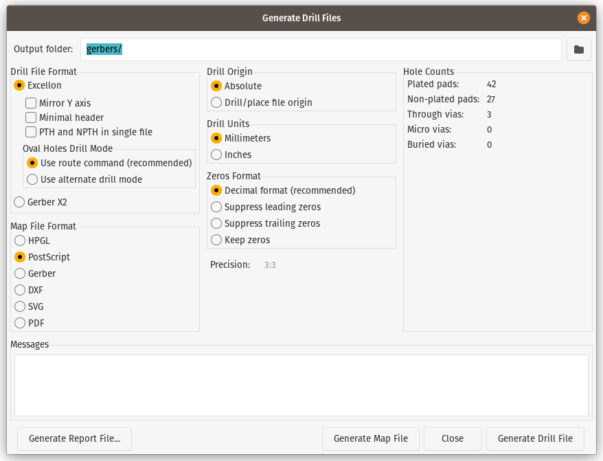
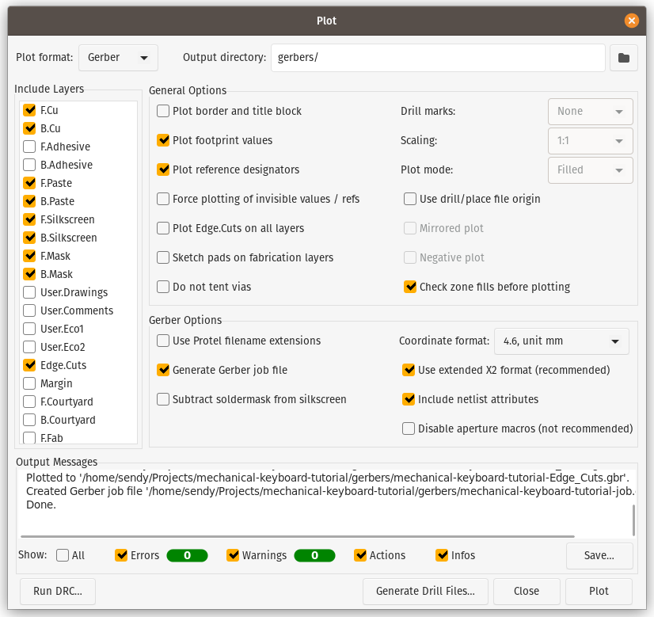

# Creating Production Files

To order the PCB to the manufacturer, we need to plot production files called **gerbers**, **gerbers** file are collection of multiple file to be used in **plotting machine**, we can generate it directly in **KiCad PCB Editor**.

- Open <kbd>File</kbd> then select <kbd>Plot...</kbd>
- Select **Plot format** as **Gerber**
- Set the **Output directory** if needed, I will use `gerbers` sub folder to keep my working directory clean
    
- Select <kbd>Generate Drill Files...</kbd> button to generate drilling coordinate file
- Choose **Milimeters** in **Drill units**, if the manufacturer use inches as measurement unit, keep it in **Inches**
    
- Press <kbd>Generate Drill File</kbd> then <kbd>Close</kbd> when done
- Back to the previous screen, click <kbd>Plot</kbd> button on the window
    

Now we have all gerbers file needed, next is to compress those files into one archive with `.zip` or `.rar` depending on the manufacturer requirements.

You can choose any PCB manufacturer out there, just search it on your search engine.
