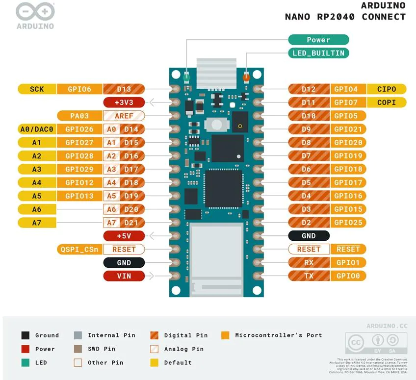
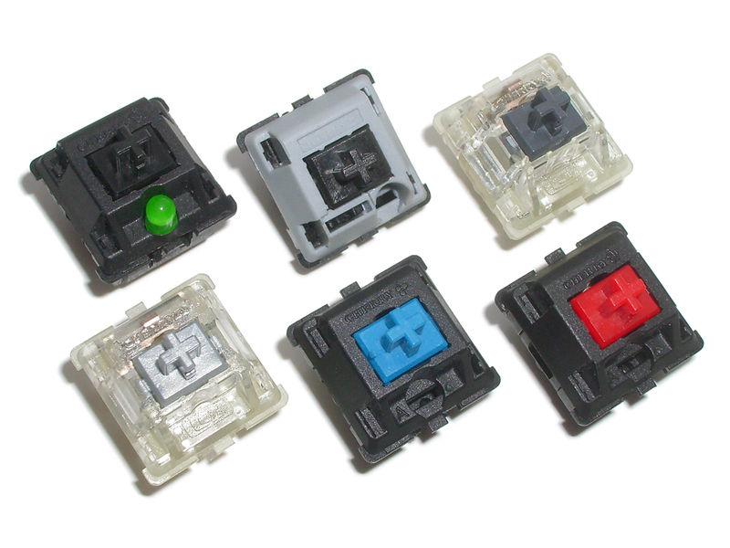
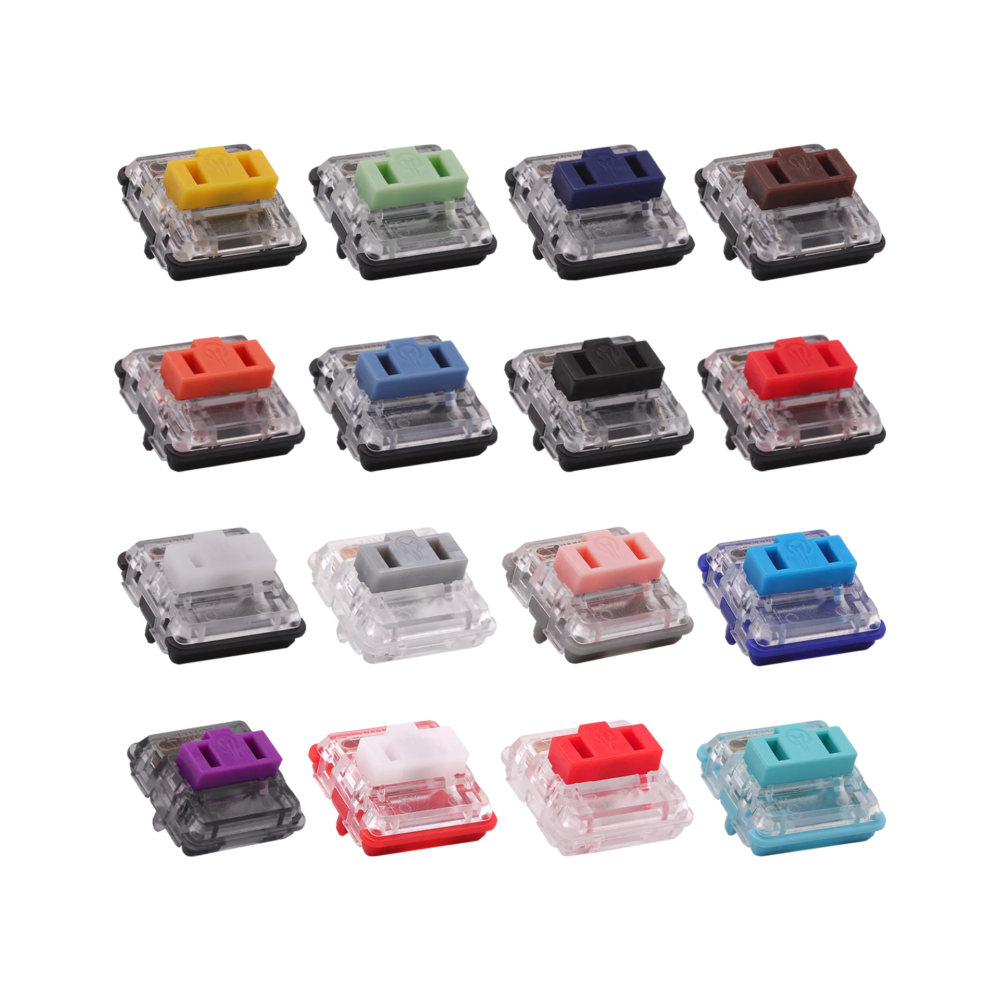
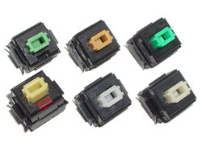
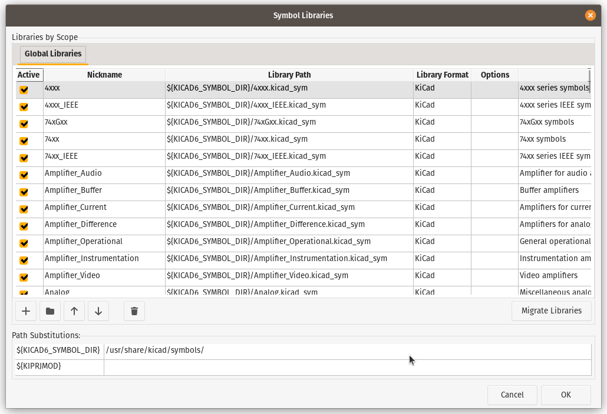
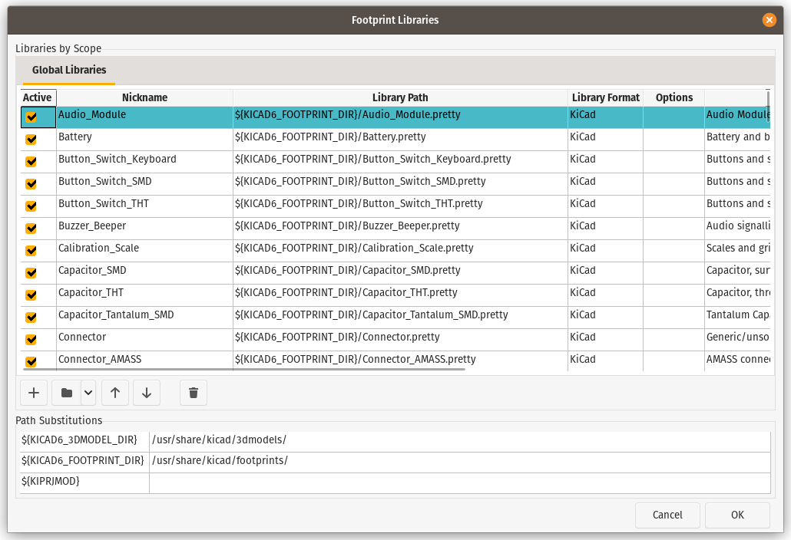

# Setup Additional Libraries

Not all the symbols and footprint for making a mechanical keyboard PCB are preinstalled in KiCad, thanks to the community who collecting it or even design their own symbols or footprint and publish it as an open source resource.

The most common resource we need but not available by default in KiCad are `controllers` and `switches` footprint.

:::info

This setup will apply as Global Settings, if you decide to setup it as a project settings, please follow [Create New Project](create-new-project.mdx) first

:::

## Controllers

Many of controllers are available, the controller works to translate user's input on the switch keystroke into set of input instructions to your host (PC, computers, even smartphone).

Commonly in the community, we are using *atmega*, *stm32* or *raspberry rp2040* as the controller, either we use SMT method (soldered to main PCB) or go with development board such as Arduino ProMicro or Raspberry Pi RP2040 Nano. 

_Image by ARDUINO_

## Switches

We have various kind of switches globally, but we can focus with MX styles (Cherry MX alike), Choc by Alps or Alps style.

### MX Style Switches

_Image by [Deskthority Wiki](https://deskthority.net/wiki/Cherry_MX)_

MX style is the most common switches, firstly developed by [Cherry AG](https://www.cherrymx.de/en) and become most common footprint for mechanical keyboard.

### Kailh Choc

_Image by Chosfox_

Kailh Choc is switch developed by [Kailh](https://www.kailh.net/), a manufacturing company that focusing on electronics switches, **Choc** is a low profile switch series and lower than MX and Alps.

### Alps Style

[Alps](https://www.alpsalpine.com/e/) (a manufacturing company focus on electronic components) once producing switches for mechanical keyboard, it characteristic for being robust and easy to dismantle and modify are famously known in the community, but the main problem on this kind of switch is prone to dust and stain in the contact leaf.

Alps stopped their production for mechanical keyboard switches and [Matias](https://matias.ca/switches/) continue it.

## Resources

Next step is to download all resources for **symbols** and **footprints**, here we will download resource from [keebio](https://keeb.io/) and [ai03](https://ai03.com/), thanks to them to provide us on their github repository.

- [keebio-components](https://github.com/keebio/keebio-components)
- [keebio-parts](https://github.com/keebio/Keebio-Parts.pretty)
- [MX_Alps_Hybrid](https://github.com/ai03-2725/MX_Alps_Hybrid)

First, download all the content from repository above, clone them or download as zip will works.

### Symbol Libraries

Next, open the KiCad application, open `Preferences` -> `Manage Symbol Libraries...`, a new window will appear with all of symbol list, if a prompt asking you to configure global symbol, just use recommended settings

- Click `Folder` at bottom left with `Add existing library to table` hint
- Browse your downloaded file, select any file with `.kicad_sym` or `.lib` file extension
- Click `OK`

### Footprint Libraries

Similar steps with the Symbol Libraries, open `Preferences` -> `Manage Footprint Libraries...`, a new window will appear with all the footprints, if a prompt asking you to configure global footprints, just use recommended settings.

- Click `Folder` at bottom left
- Browse your downloaded file, select any folder with `.pretty` suffix
- Click `OK`

