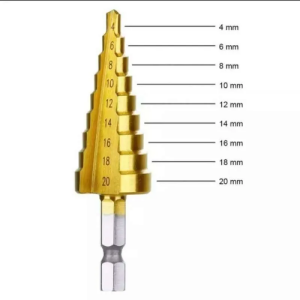

# Buttons Box

> This post series is written in Bahasa Indonesia, please use translation tools / plugin to localize it to your language.


Beberapa minggu lalu, saya membeli Logitech G29 yang sudah ada di bucket list sejak lama, sejak saat itu saya merasa setup untuk bermain simulator bisa lebih ditingkatkan lagi pengalamannya, dan kebetulan saya mendapatkan ide untuk membuat serangkaian tombol-tombol dan dipasang di sebelah setirnya. Targetnya adalah memiliki *Button Box*, *Telemetry Display* sederhana, atau dashboard, dan halaman ini akan fokus membahas **Buttons Box**, atau kotak tombol-tombol?

## Bahan-bahan


| Quantity  | Nama Part                         | Gambar                                                        |
|-----------|-----------------------------------|---------------------------------------------------------------|
| 8         | Push Button                       |                      |
| 4         | EC11 Encoder                      |                                 |
| 4         | Toggle Switch (On-On / Off-On)    |            | 
| 2         | Toggle Switch (On-Off-On)         |   |
| 1         | Guarded Toggle Switch (With LED)  |           |
| 1         | Push Button 5mm                   |           |
| 17        | Fast Switching Diodes (1N4148)    |                          |
| 1         | Project Box 6x                    |                                |
| 1 meter   | Kabel Pelangi                     |                                  |

## Alat-alat

| Nama Alat                         | Gambar                            |
|-----------------------------------|-----------------------------------|
| Solder                            |    |
| Timah Solder                      |      |
| Mata Bor Piramid (Stepped Cone)   |          |

## Wiring Diagram


Yang membedakan dengan diagram Mechanical Keyboard yang biasa saya kerjakan, di arduino ini secara umum orientasi untuk dioda adalah ROW to COL, yang mana saya biasa menggunakan COL to ROW saat merakit Mechanical Keyboard karena firmware QMK nya bisa mengatur orientasi ini dengan mudah. (*referensi: [Routing / Wiring - Mechanical Keyboard](/docs/mechanical-keyboards/create-schematic#routing--wiring)*)

Kenapa saya pasang dioda? Padahal di Wiki Simhub bagian [Arduino Button Matrix](https://github.com/SHWotever/SimHub/wiki/Arduino---Button-matrix) tidak diharuskan memasang dioda.


Alasannya adalah saya memakai Toggle Switch (yang akan menyala terus), sehingga dibutuhkan dioda agar tidak ghosting ketika saya menekan tombol yang lainnya. Ghosting adalah ketika kita menekan 1 atau 2 tombol secara bersamaan, maka seluruh tombol dalam satu jalur tersebut ikut terdeteksi ditekan.

## Langkah Pengerjaan

### Melubangi Project Box

Langkah pertama yang saya kerjakan adalah membuat layout dan membuat lubang untuk komponen-komponennya, lebih baik jika diukur terlebih dahulu diameter tiap komponen agar lebih memudahkan. Gunakan *Stepped Cone Drill* atau mata bor piramida untuk melubangi project box.

> Saya tidak mendokumentasikan / memotret proses ini, jadi tidak ada gambar.

### Handwiring


Yang harus diperhatikan ketika menyolder:

- Untuk toggle switch yang skema ON-ON, jika ingin membuat posisi ON di atas, maka rangkaian dipasang di bagian bawah, karena ketika posisi saklar di atas, kontak akan menghubungkan pin tengah dan pin bawah
- Pada Encoder EC11, pada pin encoder (yang 3 buah pin berjejer) tidak perlu dipasang dioda, dan rangkaiannya adalah `PIN A - GND - PIN B`, pin A dan pin B harus dihubungkan ke 1 data pin dan tidak bisa berbagi dengan pin lain
- Untuk switch dengan LED (switch dengan cover guard), kaki bagian bawah yang sejajar dengan tulisan 12V saya gunakan jalur input (jalur *ROW*) dan pin LED (yang sejajar dengan tulisan OFF) ke `GND`, sementara pin lainnya (yang sejajar dengan tulisan 20A) saya sambungkan ke Dioda yang menuju ke jalur *COLUMN*. Dengan begini, ketika switch pada posisi ON, LED akan menyala.


## Firmware

Untuk firmware yang saya gunakan adalah Arduino dengan pustaka `Joystick` dan `Keypad`, silakan unduh [Arduino IDE](https://www.arduino.cc/en/software) terlebih dahulu. Code firmware bersumber dari [AM Studio 32 Functions Box](https://github.com/AM-STUDIO/32-FUNCTION-BUTTON-BOX/blob/master/ARDUINO_BUTTON_BOXV2.ino) yang saya modifikasi sedikit pada *Toggle Switch*

```c title="Arduino_Button_Box_v1.ino" showLineNumbers
// BUTTON BOX
// USE w ProMicro
// Tested in WIN10 + Assetto Corsa
// AMSTUDIO
// 20.8.17

#include <Keypad.h>
#include <Joystick.h>

#define ENABLE_PULLUPS
#define NUMROTARIES 4
#define NUMBUTTONS 24
#define NUMROWS 4
#define NUMCOLS 6

byte buttons[NUMROWS][NUMCOLS] = {
    {0, 1, 2, 3},
    {4, 5, 6, 7, 20},
    {8, 9, 10, 11, 12, 13},
    {14, 15, 16, 17, 18, 19},
};

struct rotariesdef {
  byte pin1;
  byte pin2;
  int ccwchar;
  int cwchar;
  volatile unsigned char state;
};

rotariesdef rotaries[NUMROTARIES] {
    {2, 3, 24, 25, 0},
    {4, 5, 26, 27, 0},
    {6, 7, 28, 29, 0},
    {8, 9, 30, 31, 0},
};

#define DIR_CCW 0x10
#define DIR_CW 0x20
#define R_START 0x0

#ifdef HALF_STEP
#define R_CCW_BEGIN 0x1
#define R_CW_BEGIN 0x2
#define R_START_M 0x3
#define R_CW_BEGIN_M 0x4
#define R_CCW_BEGIN_M 0x5
const unsigned char ttable[6][4] = {
    // R_START (00)
    {R_START_M, R_CW_BEGIN, R_CCW_BEGIN, R_START},
    // R_CCW_BEGIN
    {R_START_M | DIR_CCW, R_START, R_CCW_BEGIN, R_START},
    // R_CW_BEGIN
    {R_START_M | DIR_CW, R_CW_BEGIN, R_START, R_START},
    // R_START_M (11)
    {R_START_M, R_CCW_BEGIN_M, R_CW_BEGIN_M, R_START},
    // R_CW_BEGIN_M
    {R_START_M, R_START_M, R_CW_BEGIN_M, R_START | DIR_CW},
    // R_CCW_BEGIN_M
    {R_START_M, R_CCW_BEGIN_M, R_START_M, R_START | DIR_CCW},
};
#else
#define R_CW_FINAL 0x1
#define R_CW_BEGIN 0x2
#define R_CW_NEXT 0x3
#define R_CCW_BEGIN 0x4
#define R_CCW_FINAL 0x5
#define R_CCW_NEXT 0x6

const unsigned char ttable[7][4] = {
    // R_START
    {R_START, R_CW_BEGIN, R_CCW_BEGIN, R_START},
    // R_CW_FINAL
    {R_CW_NEXT, R_START, R_CW_FINAL, R_START | DIR_CW},
    // R_CW_BEGIN
    {R_CW_NEXT, R_CW_BEGIN, R_START, R_START},
    // R_CW_NEXT
    {R_CW_NEXT, R_CW_BEGIN, R_CW_FINAL, R_START},
    // R_CCW_BEGIN
    {R_CCW_NEXT, R_START, R_CCW_BEGIN, R_START},
    // R_CCW_FINAL
    {R_CCW_NEXT, R_CCW_FINAL, R_START, R_START | DIR_CCW},
    // R_CCW_NEXT
    {R_CCW_NEXT, R_CCW_FINAL, R_CCW_BEGIN, R_START},
};
#endif

byte rowPins[NUMROWS] = {15, 14, 16, 10};
byte colPins[NUMCOLS] = {21, 20, 19, 18, 0, 1};

Keypad buttbx = Keypad(makeKeymap(buttons), rowPins, colPins, NUMROWS, NUMCOLS);

Joystick_ Joystick(JOYSTICK_DEFAULT_REPORT_ID,
                   JOYSTICK_TYPE_JOYSTICK, 32, 0,
                   false, false, false, false, false, false,
                   false, false, false, false, false);

void setup() {
  Joystick.begin();
  rotary_init();
}

void loop() {
  CheckAllEncoders();

  CheckAllButtons();
}

void CheckAllButtons(void) {
  if (buttbx.getKeys()){
    for (int i = 0; i < LIST_MAX; i++){
      if (buttbx.key[i].stateChanged){
        if ((buttbx.key[i].kchar >= 0 && buttbx.key[i].kchar <= 3) || (buttbx.key[i].kchar == 12 || buttbx.key[i].kchar == 13 || buttbx.key[i].kchar == 18 || buttbx.key[i].kchar == 19 || buttbx.key[i].kchar == 20)) {
          switch (buttbx.key[i].kstate) {
            case PRESSED:
            case HOLD:
              Joystick.setButton(buttbx.key[i].kchar, 1);
              delay(100);
              break;
            case RELEASED:
            case IDLE:
              Joystick.setButton(buttbx.key[i].kchar, 1);
              Joystick.setButton(buttbx.key[i].kchar, 0);
              delay(100);
              break;
          }
        } else {
          switch (buttbx.key[i].kstate) {
            case PRESSED:
            case HOLD:
              Joystick.setButton(buttbx.key[i].kchar, 1);
              delay(100);
              break;
            case RELEASED:
            case IDLE:
              Joystick.setButton(buttbx.key[i].kchar, 0);
              delay(100);
              break;
            }
        }
      }
    }
  }
}

void rotary_init() {
  for (int i = 0; i < NUMROTARIES; i++) {
    pinMode(rotaries[i].pin1, INPUT);
    pinMode(rotaries[i].pin2, INPUT);
    #ifdef ENABLE_PULLUPS
        digitalWrite(rotaries[i].pin1, HIGH);
        digitalWrite(rotaries[i].pin2, HIGH);
    #endif
  }
}

unsigned char rotary_process(int _i) {
  unsigned char pinstate = (digitalRead(rotaries[_i].pin2) << 1) | digitalRead(rotaries[_i].pin1);
  rotaries[_i].state = ttable[rotaries[_i].state & 0xf][pinstate];
  return (rotaries[_i].state & 0x30);
}

void CheckAllEncoders(void) {
  for (int i = 0; i < NUMROTARIES; i++) {
    unsigned char result = rotary_process(i);
    if (result == DIR_CCW) {
      Joystick.setButton(rotaries[i].ccwchar, 1);
      delay(50);
      Joystick.setButton(rotaries[i].ccwchar, 0);
    };
    if (result == DIR_CW) {
      Joystick.setButton(rotaries[i].cwchar, 1);
      delay(50);
      Joystick.setButton(rotaries[i].cwchar, 0);
    };
  }
}
```

Yang saya modifikasi adalah baris `113` hingga `127`, di baris ini

```c showLineNumbers
if ((buttbx.key[i].kchar >= 0 && buttbx.key[i].kchar <= 3) || (buttbx.key[i].kchar == 12 || buttbx.key[i].kchar == 13 || buttbx.key[i].kchar == 18 || buttbx.key[i].kchar == 19 || buttbx.key[i].kchar == 20)) {
    switch (buttbx.key[i].kstate) {
    case PRESSED:
    case HOLD:
        Joystick.setButton(buttbx.key[i].kchar, 1);
        delay(100);
        break;
    case RELEASED:
    case IDLE:
        Joystick.setButton(buttbx.key[i].kchar, 1);
        Joystick.setButton(buttbx.key[i].kchar, 0);
        delay(100);
        break;
    }
}
```

Jadi, saat key pada posisi-posisi `IDLE` atau tidak aktif, kode ini akan memanggil kembali fungsi untuk mengirim sinyal "PUSH" ke controller, alasannya adalah, banyak game yang tidak support toggle switch, yang artinya ketika ingin mematikan fungsi di game, kita harus pencet ulang tombol yang diset baik di keyboard atau di keypad, sehingga ketika kita matikan toggle switch, kita butuh mengirim kembali sinyal "PUSH" ke controller agar diteruskan ke game lalu mematikan fungsi tersebut.

Jika game yang akan dimainkan dengan box ini hanya Euro Truck Simulator 2 / American Truck Simulator, tidak perlu mengubah kode terlalu banyak, karena di kedua game tersebut sudah mendukung Toggle Switch Mode, cukup tetap nyalakan switch ketika *assign* switch tersebut ke *keys mapping*

Referensi yang saya pakai:

<iframe width="560" height="315" src="https://www.youtube.com/embed/YQ7Ro_SuVoY?si=2IhzSIQ8coZBtGMR" title="YouTube video player" frameborder="0" allow="accelerometer; autoplay; clipboard-write; encrypted-media; gyroscope; picture-in-picture; web-share" referrerpolicy="strict-origin-when-cross-origin" allowfullscreen></iframe>

Selesai, selamat mencoba.
